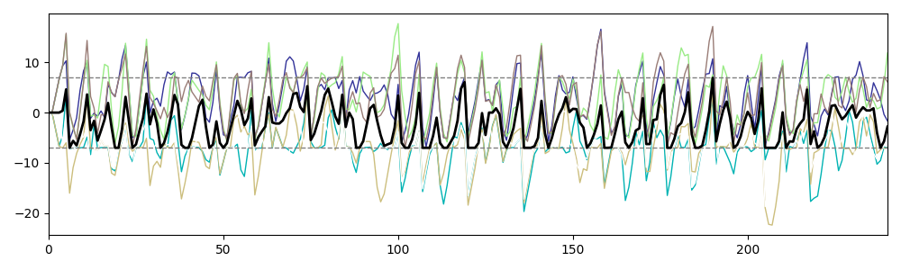

# Simulation of the horsetail movement
A simulation program of the horsetail movement, implemented in Python.
The original R version is [here](https://github.com/ikumi-fujita/horsetail).

## Example
    $ python main.py
    [Test run]
    100%|███████████████████████████████████████| 10000/10000 [00:02<00:00, 3345.16it/s]
    Number of simulations: 10000
    Number of cores: 8
    Elapsed time: 3.47 s
    
    [Draw a figure]
    Exported: result.png

## Reference
- I Fujita, A Kimura, A Yamashita. A force balance model for a cell size‐dependent meiotic nuclear oscillation in fission yeast. _EMBO rep_ 24: e55770 (2023) https://doi.org/10.15252/embr.202255770
